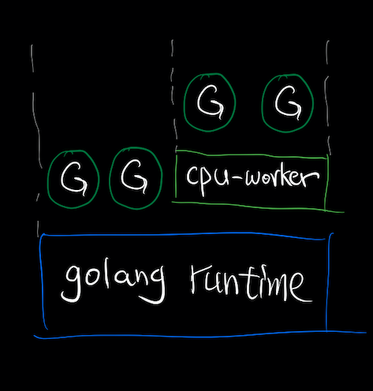
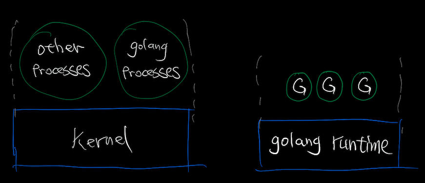

## CPU-Worker 是什么

CPU-Worker是一个位于Golang Runtime之上的应用层goroutine调度器。



优点：完全处于应用层，可根据具体业务的特点定制调度策略；对Golang Runtime没有改动，能兼容所有大于等于 Golang 1.1 的版本（即需要runtime支持Work-Stealing）。

## 术语定义

**Event Intensive Task**，顾名思义，事件密集型任务，其生命周期中的绝大部分时间都在等待event（可称之为off-cpu），只有极少部分时间在进行cpu运算。在Golang中，这些事件包括：被阻塞的i/o操作，被阻塞的channel读写，timer等待，mutex lock等等场景。

比如，下面这段代码就是典型的event intensive task：

```go
func eiTask() {
	wCh := make(chan struct{})
	go func() {
		time.Sleep(time.Millisecond)
		wCh <- struct{}{}
	}()
	<-wCh
}
```

**CPU Intensive Task**，顾名思义，CPU密集型任务，其生命周期中的绝大部分甚至全部时间都在进行cpu运算（可称之为on-cpu），只有极少部分时间处于甚至从未处于过等待event的状态。

比如，下面这段代码就是典型的cpu intensive task：

```go
func ck() uint32 {
  return crc32.ChecksumIEEE(make([]byte, 1024*512))
}
```

## 问题描述

Golang Runtime调度器的调度策略目前的实现为公平调度，但在实际应用场景中，不同类型的任务之间、甚至相同类型的任务之间都可能需要存在优先级关系。比如用Golang实现一个块存储引擎，那么一般情况下，相比于各类cpu任务，i/o任务应该拥有更高的优先级，因为在这种情况下，系统瓶颈更可能是在i/o而非cpu；再比如，我们用Golang实现一个网络服务，要求在高负载下能保证其中一些轻量CPU请求的延迟指标，但是在目前Golang Runtime的实现里，如果running & runnable goroutine中出现了一定数量的需要较长时间运行的cpu intensive task，那么必然会冲击到延迟指标。所以，我们需要一个能够根据应用特点自适应或者能够自由定制其具体调度策略的goroutine调度器。



从另一个角度来说，我们将Kernel提供的线程模型和Golang提供的协程模型作对比，除了Golang协程比线程天生的低成本高并发优势之外，Kernel线程模型中一些十分有用的机制在Golang Runtime的协程模型中目前并不能找到与之对应的实现，比如[调度策略与优先级的动态修改](https://man7.org/linux/man-pages/man7/sched.7.html)。

## 实现原理

在阅读之前需要对GMP模型和Work-Stealing有一定的基础了解，除了阅读源码之外，推荐的资料如下：

* [Go 语言设计与实现：调度器](https://draveness.me/golang/docs/part3-runtime/ch06-concurrency/golang-goroutine/)

* [深入golang runtime的调度](https://zboya.github.io/post/go_scheduler/)

### 针对CPU密集型任务的基础调度思想

假设现在应用层只有两类Task，Event Intensive Task和CPU Intensive Task。

首先，Golang Runtime为我们提供了基础的公平调度和Work-Stealing等机制，但是它解决不了前面陈述的不同任务之间调度优先级的问题，我们可以在目前Golang Runtime所提供机制的基础上，在应用层我们自己管理自己的CPU Intensive Task，只要保证它们的并行度低于 *GOMAXPROCS*，这样就能保证Event Intensive Task一旦ready就会迅速地被consume 掉。

比如*GOMAXPROCS*当前值为6，并且当前的运行环境能提供这么多并行的线程资源，那么我们可以将任一时刻CPU Intensive Task的并行度控制在4个，那么剩余的两个P就自然会被runtime专门用来处理Event Intensive Task，这样就保证了Event Intensive Task的Latency。

为了解决某些CPU Intensive Task可能会运行很长时间的问题，我们可以引入时间片的概念，这样调度器就能做更精细的调度，比如针对不同任务的时间片动态划分和优先级策略调整等等。

代码和运行示例位于[此处](https://github.com/hnes/cpuworker/blob/5471e4cfaf3f57bf1f37f5cc6344bab5b5339501/README.md#test-result-on-aws)。

实现中，我们为每个Task传一个checkpoint函数入参，Task在执行过程中应该在不影响性能的前提下尽可能多的调用checkpoint函数，在此函数的执行过程中，如果发现cpuworker调度器发来了suspend信号，就将自己挂起直到收到resume信号继续运行。

### 推广到通用调度器

上面针对CPU密集型任务的基础调度器在理论上已经能够解决我们的问题，但是具体在使用时需要应用自己做好划分，可能会带来一定复杂度，尤其是对于那些已有一定量代码遗产并且可能大部分是类似 “CPU Intensive + Event Intensive” 这样类型耦合的代码而言，比如：

```
func hybridTask() {
  for{
    wCh := make(chan struct{})
    go func() {
      time.Sleep(time.Millisecond)
      wCh <- struct{}{}
    }()
    crc32.ChecksumIEEE(make([]byte, 1024*512))
    <-wCh
	}
}
```

对于这些项目将CPU Intensive Task与Event Intensive Task解耦开可能会付出很大的成本，所以我们进一步提出并实现了一种更通用的应用层调度模型：

```go
func hybridTask(eventCallFp func(func())) {
  for{
    // nonblock
    wCh := make(chan struct{})
    // nonblock goroutine spawning
    go func() {
      // another event intensive goroutine
      time.Sleep(time.Millisecond)
      wCh <- struct{}{}
    }()
    // nonblock
    crc32.ChecksumIEEE(make([]byte, 1024*512))
    // event operation
    eventCallFp(func(){
      <-wCh
    })
  }
}
```

此处的eventCallFp与之前的checkpointFp类似，唯一不同的是，eventCallFp会有一个函数入参，当此入参非nil时，它需要是一个Event Intensive Task。

eventCallFp的执行流程是，首先判断入参是否为nil，若入参为nil，等价于调用checkpointFp，否则：立即将P还给cpuworker调度器，然后执行入参中的Event Intensive Task，执行完毕之后将自己放到cpuworker调度器的runnable task queue里面，在保证每个Task不会被饿死的前提下，cpuworker调度器会根据每个Task的运行特征给每个Task计算一个动态的优先级分数，尽可能保证CPU用时短小的、很像Event Intensive Task的Task得到优先调度权。

核心思想是，如果一个Task的on-cpu时间越短、off-cpu时间越长，那么它的优先级就应该越高。

一个Task的生命周期中可能的阶段如下：


① 新创建的Task第一次被调度运行

② Task在执行checkpointFp检查时发现已经收到了调度器的挂起指令，于是将自己放到runnable task queue里，阻塞等待恢复运行信号

③ 挂起中的Task收到了调度器发来的恢复运行信号，继续运行

④ Task先将P还给cpuworker调度器，然后执行Event Intensive Task

⑤ 完成Event Intensive Task的执行，Task将自己放到runnable task queue里，等待被恢复运行

⑥ Task结束运行
